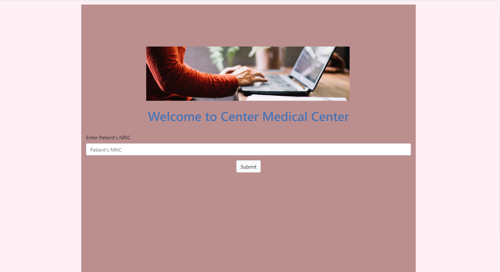
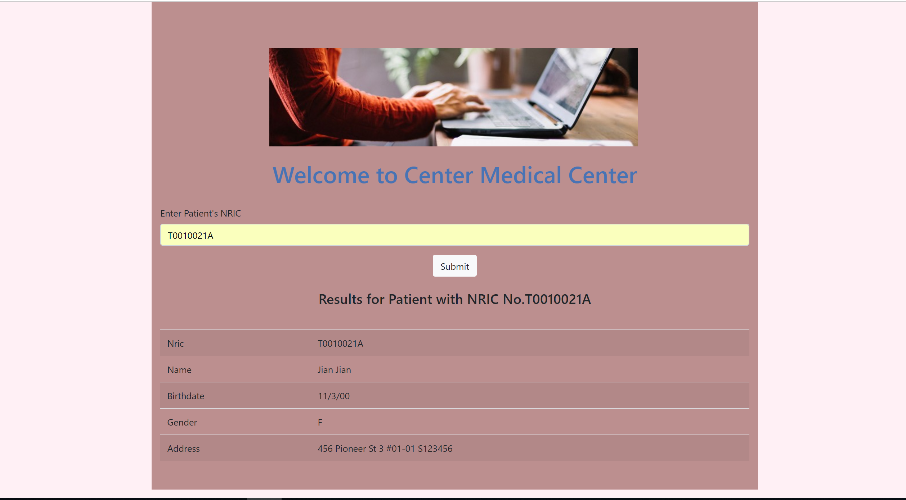
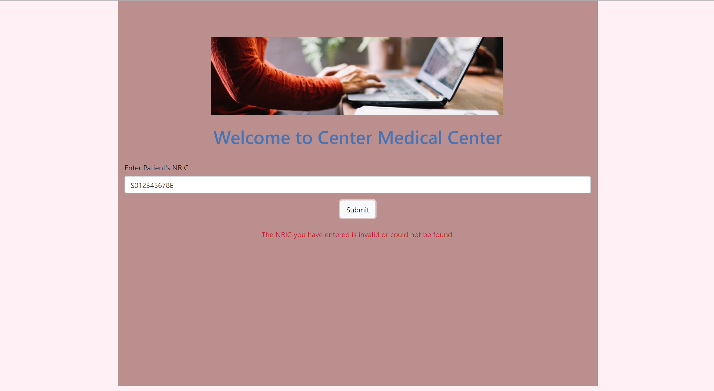

# PatientServiceLab

## Brief Description
A simple user interface to request for patient's record.

## Configuration on Wins
1. Download and install node.js
2. Copy PatientService folder into C:\ESD -> C:\ESD\PatientService
3. Double-click init.bat to do a one-time setup
4. Run wamp and copy html file into the 'www' folder
5. Double-click run.bat to start the service, in order to make the service available

## Screenshot
#### User Interface Display

#### Patient's record successfully found

#### Invalid NRIC given

